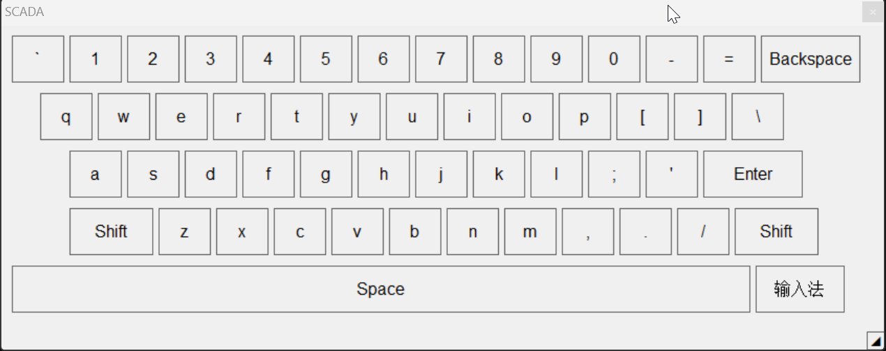

# scada 软键盘

一个用 **Janet + Win32 原生 FFI** 实现的轻量级屏幕软键盘。无需 .NET，单文件可执行，支持拖拽缩放、Shift 切换大小写、长按 Shift 切换输入法中/英模式。

---

## 功能特性

- 数字键 `0-9`
- QWERTY 字母键 `a-z`
- `Shift` 键：短按切换大小写，长按切换输入法中/英
- 右下角输入法按钮：点击切换输入法中/英
- `Space`、`Backspace`、`Enter`
- 右下角拖动柄，可按固定宽高比缩放整个键盘
- 点击按键不抢夺目标窗口焦点
- 单实例运行；重复执行 `scada-keyboard.exe --code=...` 会唤起已有窗口并切换语言
- 唤起时短暂置前，不长期保持 Always On Top
- 窗口标题固定为 `SCADA`
- 支持通过启动参数设置输入法按钮文案语言

---

如图：


## 项目结构

```
scada-keyboard/
├── softkeyboard.janet    # 软键盘源代码（Janet + Win32 FFI）
├── project.janet         # jpm 项目配置
├── build-exe.bat         # 旧编译脚本；当前以 README 的 PowerShell 构建命令为准
├── build/                # jpm 构建输出目录
│   └── scada-keyboard.exe
├── scada-keyboard.exe    # 最终可执行文件（从 build/ 复制出来）
└── README.md             # 本文件
```

---

## 环境要求

- Windows 10/11 x64
- [Janet](https://janet-lang.org/)（已安装并加入 PATH）
- [jpm](https://github.com/janet-lang/jpm)（通常随 Janet 一起安装）
- MinGW-w64 `gcc`（用于最终链接生成 exe）

---

## 快速运行

如果你已经拿到了 `scada-keyboard.exe`，直接双击运行即可。键盘窗口会显示到前台，打开记事本等输入窗口后点击按键即可输入。

也可以传入语言 code，设置右下角输入法按钮的显示文字：

```batch
scada-keyboard.exe --code=en_gb
```

程序采用单实例机制。如果已有键盘进程正在运行，再次执行上述命令不会创建第二个窗口，而是把 `--code` 参数转发给已有进程、恢复/置前已有窗口，然后新进程退出。前端或 Electron 侧可以继续把这条命令作为统一的“唤起键盘”入口，不需要自己判断键盘是否已运行。

点击输入法按钮时，程序会优先使用 `SendInput` 发送带 scan code 的左 Shift，并把诊断信息写入 `%APPDATA%\scada-keyboard\scada-keyboard.log`。如果现场机器仍不能切换，可先查看该日志里的 `[ime]` 行，确认前台窗口、键盘布局和 `SendInput` 返回值。

不传参数或传入未支持的 code 时，默认使用中文 `zh_cn`。

### 支持的语言 code

| code | 语言 | 输入法按钮文案 |
| --- | --- | --- |
| `zh_cn` | 中文 | 输入法 |
| `en_gb` | 英文 | Input Method |
| `ja_jp` | 日文 | 入力方式 |
| `ar_eg` | 阿拉伯语 | طريقة الإدخال |
| `az_az` | 阿塞拜疆语 | Daxiletmə üsulu |
| `bn_bd` | 孟加拉语 | ইনপুট পদ্ধতি |
| `ru_ru` | 俄罗斯语 | Метод ввода |
| `ca_es` | 加泰罗尼亚语 | Mètode d'entrada |
| `cs_cz` | 捷克语 | Metoda vstupu |
| `da_dk` | 丹麦语 | Inputmetode |
| `de_de` | 德语 | Eingabemethode |
| `el_gr` | 希腊语 | Μέθοδος εισόδου |
| `es_es` | 西班牙语 | Método de entrada |
| `eu_es` | 巴斯克语 | Sarrera metodoa |

---

## 源码运行

在项目目录下：

```bash
janet softkeyboard.janet
```

这会直接启动软键盘窗口。

源码运行也支持相同的语言 code：

```bash
janet softkeyboard.janet --code=ja_jp
```

---

## 编译成 exe

当前验证可用的构建方式是：

1. 使用 Janet/JPM 从 `softkeyboard.janet` 生成 `build/scada-keyboard.exe.c`
2. 使用 MinGW `gcc` 把生成的 C 文件和 Janet runtime 源码一起链接成 exe
3. 把 `build/scada-keyboard.exe` 复制到项目根目录 `scada-keyboard.exe`

在 PowerShell 中执行：

```powershell
cd D:\code\scada\janet-keyboard

C:\Users\Administrator\scoop\apps\janet\current\bin\janet.exe -k softkeyboard.janet

$env:PATH='C:\Users\Administrator\scoop\apps\mingw\15.2.0-rt_v13-rev1\bin;C:\Users\Administrator\scoop\apps\janet\current\bin;' + $env:PATH
C:\Users\Administrator\scoop\apps\janet\current\bin\janet.exe -m C:\Users\Administrator\scoop\apps\janet\1.40.1\lib\janet -e '(import jpm/cli) (cli/main "jpm" "--cc=gcc" "--cc-link=gcc" "--c++=g++" "--c++-link=g++" "--cflags=-std=c99" "--cppflags=-std=c++11" "--lflags=" "--is-msvc=false" "--headerpath=C:/Users/Administrator/scoop/apps/janet/current/C" "--libpath=C:/Users/Administrator/scoop/apps/janet/current/C" "build")'

$env:PATH='C:\Users\Administrator\scoop\apps\mingw\15.2.0-rt_v13-rev1\bin;' + $env:PATH
gcc -O2 -I C:\Users\Administrator\scoop\apps\janet\current\C build\scada-keyboard.exe.c C:\Users\Administrator\scoop\apps\janet\current\C\janet.c -o build\scada-keyboard.exe -lws2_32 -lmswsock -ladvapi32 -lpsapi

Copy-Item -Path .\build\scada-keyboard.exe -Destination .\scada-keyboard.exe -Force
```

> 注意：上面的 `C:\Users\Administrator\scoop\apps\...` 是当前机器上的 Janet 和 MinGW 安装路径。如果换机器构建，需要按实际安装路径调整。

执行完成后，可执行文件会生成在：

- `build/scada-keyboard.exe`
- `scada-keyboard.exe`

### 关于 JPM 链接报错

当前环境中，JPM 的 `build` 命令可以成功生成 `build/scada-keyboard.exe.c`，但它后续自动链接阶段会因为 Janet 自带的 `libjanet.lib` 和 MinGW 链接器不兼容而失败，例如出现 `undefined reference`。

这是预期现象；只要已经看到：

```text
generating executable c source build/scada-keyboard.exe.c from softkeyboard.janet
```

就可以继续执行后面的 `gcc ... janet.c ...` 手动链接命令。

### 验证 exe

可以用 `objdump` 确认可执行文件格式：

```powershell
cmd /d /c "C:\Users\Administrator\scoop\apps\mingw\15.2.0-rt_v13-rev1\bin\objdump.exe -f scada-keyboard.exe"
```

输出中应包含：

```text
file format pei-x86-64
architecture: i386:x86-64
```

---

## 使用说明

1. 启动 `scada-keyboard.exe`
2. 点击目标输入窗口（如记事本、浏览器输入框），使其获得焦点
3. 点击软键盘上的按键输入字符
4. 短按 `Shift` 切换大小写
5. 点击右下角输入法按钮切换输入法中/英模式
6. 长按 `Shift`（约 0.4 秒）也可以切换输入法中/英模式
7. 拖动右下角 `◢` 缩放键盘
8. 点击窗口右上角 `×` 关闭

---

## 实现要点

- **不自定义 WNDPROC**：Janet 的 `ffi/trampoline` 只支持单一签名回调，无法直接作为 Windows 窗口过程使用。因此采用系统内置 `STATIC` 控件做按键，主窗口使用 `DefWindowProcW`，通过轮询鼠标状态检测点击。
- **不抢焦点**：主窗口和子控件都设置 `WS_EX_NOACTIVATE`，发送按键前不再切换焦点。
- **字体随缩放**：根据按键高度动态创建 GDI 字体，并通过 `WM_SETFONT` 设置给每个控件。

---

## 已知限制

- 仅支持 Windows x64
- 不包含完整的标点符号层
- 输入法按钮和长按 Shift 的中/英切换都依赖于当前输入法把 `Shift` 作为中/英切换键

---

## 许可证

MIT
